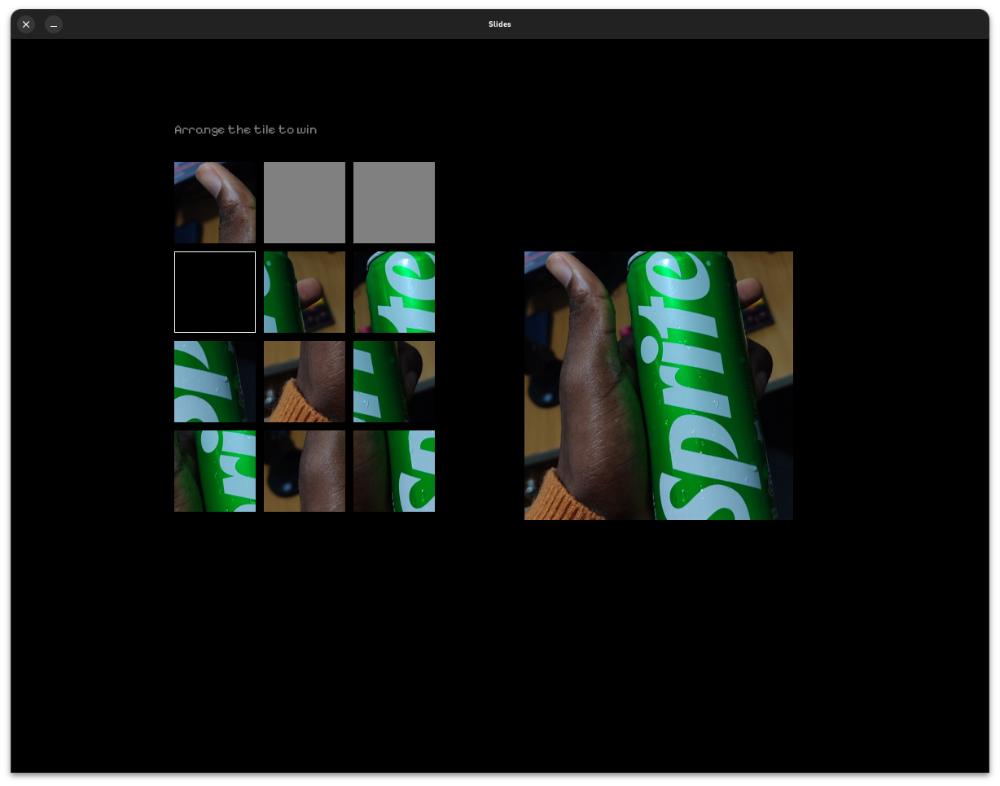

# Tile Puzzle Game

A classic sliding tile puzzle game built with **Rust** and **SDL2**. Rearrange the tiles to recreate the image using your keyboard's arrow keys!

## 🕹️ How to Play
- Use the **Arrow Keys** to move the tiles into the empty space.
- Press **H** for Help.
- Arrange the tiles correctly to win!

## 📸 Screenshot


## ⚙️ Features
- Keyboard-based controls.
- Help screen for guidance.
- Clear win condition.

## 🛠️ Built With
- **Rust**: For high-performance game logic.
- **SDL2**: For rendering graphics and handling user input.

## 🚀 Getting Started
### Prerequisites
Ensure you have the following installed:
- Rust
- SDL2 library

### Installation
1. Clone the repository:
   ```bash
   git clone https://github.com/rubbieKelvin/rusty-slides.git
   cd rusty-slides
   ```
2. Build the project:
   ```bash
   cargo build --release
   ```
3. Run the game:
   ```bash
   cargo run --release
   ```

## 🧩 Future Improvements
- Tile sliding animations.
- Multiple difficulty levels.
- Timer and scoring system.

## 🤝 Contributing
Feel free to fork this project and submit a pull request with improvements or bug fixes.

## 📄 License
This project is licensed under the **MIT License**.

## 📬 Contact
For any questions or suggestions, reach out at **dev.rubbie@gmail.com**.

Enjoy the game and happy puzzling! 🎮✨

